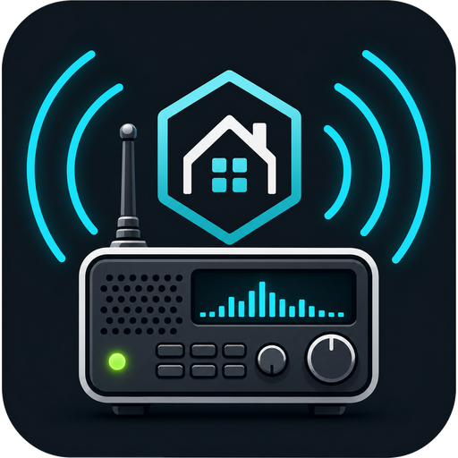

# Rdio Scanner Card



A HACS dashboard card for running a local Rdio Scanner live feed in Home
Assistant.

This card pairs with the Rdio Scanner integration:

```text
rodgrech/HA-RDIO-SCANNER
```

## Installation

### HACS custom repository

1. Open HACS in Home Assistant.
2. Add this repository as a custom repository.
3. Select `Dashboard` as the repository category.
4. Install **Rdio Scanner Card**.
5. Refresh the browser.

HACS should add this Lovelace resource:

```text
/hacsfiles/HA-RDIO-SCANNER-CARD/rdio-scanner-card.js
```

Resource type:

```text
JavaScript module
```

## Example

Local HTTP dashboard example:

```yaml
type: custom:rdio-scanner-card
mode: native
title: Rdio Scanner
url: http://rdio.local:3000
# ws_url: wss://your-secure-rdio-proxy.example/ws
# access_code: "your-unlock-code"
status_entity: sensor.rdio_scanner_status
systems_entity: sensor.rdio_scanner_systems
talkgroups_entity: sensor.rdio_scanner_talkgroups
auto_start: true
show_recordings: true
recordings_limit: 20
audio_mode: auto
show_header: true
```

Mobile app / HTTPS dashboard example:

```yaml
type: custom:rdio-scanner-card
mode: native
title: Rdio Scanner
url: https://radio.example.com
ws_url: wss://radio.example.com
status_entity: sensor.rdio_scanner_status
systems_entity: sensor.rdio_scanner_systems
talkgroups_entity: sensor.rdio_scanner_talkgroups
auto_start: false
show_recordings: true
recordings_limit: 20
audio_mode: html5
show_header: true
```

If your Rdio Scanner server does not require an unlock code, omit
`access_code`. If it does require one and you omit it, the card shows an unlock
field and remembers the code in browser localStorage after you enter it.

## Local vs Mobile App URLs

The Home Assistant integration and the dashboard card run in different places:

- The integration runs inside Home Assistant, so it can usually use the local
  LAN URL, for example `http://rdio.local:3000`.
- The dashboard card runs inside the browser, tablet, Fully Kiosk Browser, or
  Home Assistant mobile app. That device must be able to reach the URL in the
  card YAML.

If Home Assistant is loaded over `https://`, mobile WebViews usually block an
insecure Rdio Scanner WebSocket such as `ws://rdio.local:3000`. In that case
the card may show **Blocked: use WSS** or **Closed 1006**.

For the Home Assistant mobile app, Nabu Casa/external URLs, or HTTPS wall
tablets, put Rdio Scanner behind HTTPS/WSS and use:

```yaml
url: https://radio.example.com
ws_url: wss://radio.example.com
audio_mode: html5
```

For a LAN-only wall tablet loaded over plain HTTP, the local URL can be used:

```yaml
url: http://rdio.local:3000
audio_mode: auto
```

Your reverse proxy must pass WebSocket upgrade headers for native live feed to
work.

## Options

| Option | Required | Default | Description |
| --- | --- | --- | --- |
| `type` | yes | `custom:rdio-scanner-card` | Card type |
| `mode` | no | `native` | `native` for direct live feed, or `iframe` for the original embedded UI |
| `title` | no | `Rdio Scanner` | Header title |
| `url` | no | `http://rdio.local:3000` | Rdio Scanner URL |
| `ws_url` | no | derived from `url` | Override WebSocket URL, useful for `wss://` reverse proxies |
| `access_code` | no | none | Rdio Scanner unlock code for restricted access |
| `url_entity` | no | none | Entity containing the Rdio Scanner URL |
| `status_entity` | no | `sensor.rdio_scanner_status` | Integration status sensor |
| `systems_entity` | no | `sensor.rdio_scanner_systems` | Systems count sensor |
| `talkgroups_entity` | no | `sensor.rdio_scanner_talkgroups` | Talkgroups count sensor |
| `height` | no | `640` | Iframe height in pixels when `mode: iframe` |
| `show_header` | no | `true` | Show or hide the card header |
| `live_header` | no | `false` | Keep updating header values after the iframe loads |
| `auto_start` | no | `true` | Connect and subscribe to all talkgroups when the card loads in native mode |
| `show_recordings` | no | `true` | Show recent recorded-call controls in native mode |
| `recordings_limit` | no | `20` | Number of recent recorded calls to request |
| `auto_load_recordings` | no | `false` | Load recent recordings automatically after connection |
| `audio_mode` | no | `auto` | `auto`, `html5`, or `webaudio`; use `html5` for difficult Android/iOS WebViews |
| `allow_mixed_ws` | no | `false` | Allow `ws://` from an `https://` Home Assistant page; most mobile WebViews block this |

## Notes

- Native mode uses Rdio Scanner's browser WebSocket protocol directly.
- Browser autoplay rules may require pressing **Start Live** once before audio
  can play. The button primes WebAudio with a silent buffer before subscribing
  to live traffic.
- Android tablets, Fully Kiosk Browser, and the iOS Home Assistant app may work
  better with `audio_mode: html5`, which plays each call through a persistent
  hidden audio element instead of only WebAudio.
- If the card shows **Blocked: use WSS**, Home Assistant is loaded over HTTPS
  but Rdio Scanner is only available over insecure `ws://`. Use HTTP for the
  dashboard, or put Rdio Scanner behind HTTPS/WSS and set `ws_url`.
- Press **Load recent** in the recordings section to fetch recent recorded calls.
  Each row can be played through the card or downloaded as its original audio
  file.
- If you enter the unlock code in the card, it is saved in browser localStorage
  for that scanner URL. Use **Clear saved** to remove it.
- If Home Assistant is served over HTTPS and Rdio Scanner is served over HTTP,
  some browsers may block the connection as mixed content. Use HTTP for both on
  the LAN, or put Rdio Scanner behind HTTPS.

## License

MIT
